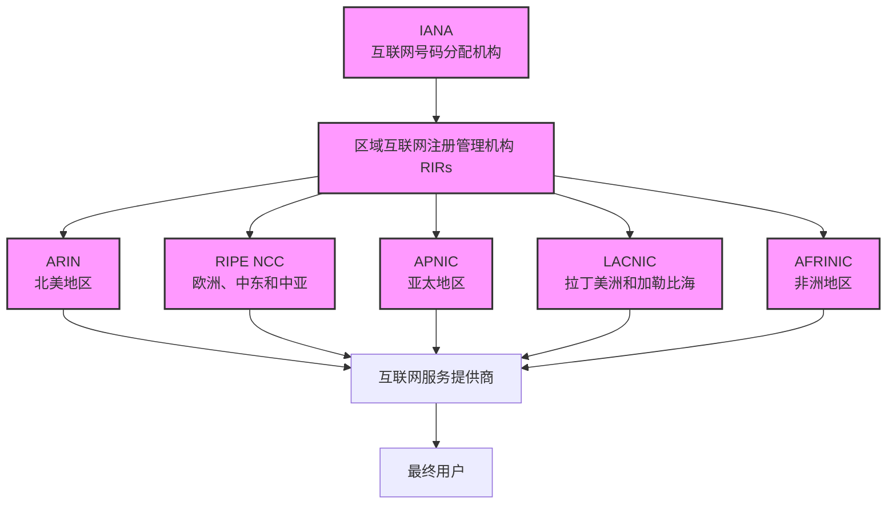

# IP和ASN分配机构层级结构

## 说明

1. **IANA (Internet Assigned Numbers Authority)**
   - 负责全球IP地址和AS号码的分配
   - 隶属于ICANN (互联网名称与数字地址分配机构)
   - 官网：https://www.iana.org/
   - WHOIS查询：https://www.iana.org/whois

2. **RIRs (Regional Internet Registries)**
   - 负责各自地理区域的IP地址和AS号码分配
   - 目前有5个RIR：
     - ARIN (北美)
       - 官网：https://www.arin.net/
       - WHOIS查询：https://whois.arin.net/
     - RIPE NCC (欧洲、中东和中亚)
       - 官网：https://www.ripe.net/
       - WHOIS查询：https://apps.db.ripe.net/db-web-ui/
     - APNIC (亚太)
       - 官网：https://www.apnic.net/
       - WHOIS查询：https://www.apnic.net/whois-search/
     - LACNIC (拉丁美洲和加勒比海)
       - 官网：https://www.lacnic.net/
       - WHOIS查询：https://www.lacnic.net/whois/
     - AFRINIC (非洲)
       - 官网：https://www.afrinic.net/
       - WHOIS查询：https://www.afrinic.net/whois

3. **分配流程**
   - IANA → RIRs → ISPs → 最终用户
   - 每个层级都有相应的分配政策和规则
   - 遵循"先到先得"和"合理使用"原则

4. **AS号码分配**
   - 同样遵循类似的层级结构
   - 由IANA分配给RIRs
   - RIRs再分配给需要AS号码的组织

5. **其他重要资源**
   - 全球IP地址分配统计：https://www.iana.org/assignments/ipv4-address-space/ipv4-address-space.xhtml
   - 全球AS号码分配统计：https://www.iana.org/assignments/as-numbers/as-numbers.xhtml
   - 各RIR的IP地址分配政策：可在各RIR官网的"Policies"部分查看

6. **补充数据库和WHOIS服务**
   - **BGPView**
     - 提供全球BGP路由和ASN信息
     - 官网：https://bgpview.io/
     - 特点：提供ASN的详细信息、前缀、邻居关系等
   
   - **IPinfo**
     - 提供IP和ASN的详细信息
     - 官网：https://ipinfo.io/
     - 特点：提供丰富的IP和ASN元数据
   
   - **PeeringDB**
     - 互联网交换点和网络互连信息数据库
     - 官网：https://www.peeringdb.com/
     - 特点：提供网络互连、对等关系等详细信息
   
   - **RADb (Route Aggregation Database)**
     - 路由策略数据库
     - 官网：https://www.radb.net/
     - 特点：提供路由策略和过滤规则信息
   
   - **IRR (Internet Routing Registry)**
     - 路由注册数据库
     - 包含多个数据库：RADb、RIPE、ARIN等
     - 特点：提供路由策略和过滤规则信息
   
   - **CAIDA AS Rank**
     - 提供ASN的排名和关系分析
     - 官网：https://asrank.caida.org/
     - 特点：提供ASN的拓扑结构和重要性分析

7. **注意事项**
   - RIR的WHOIS服务是最权威的来源，但可能不包含所有历史数据
   - 补充数据库通常提供更丰富的元数据和关系信息
   - 不同数据库的更新频率和覆盖范围可能不同
   - 建议交叉验证多个来源的信息 